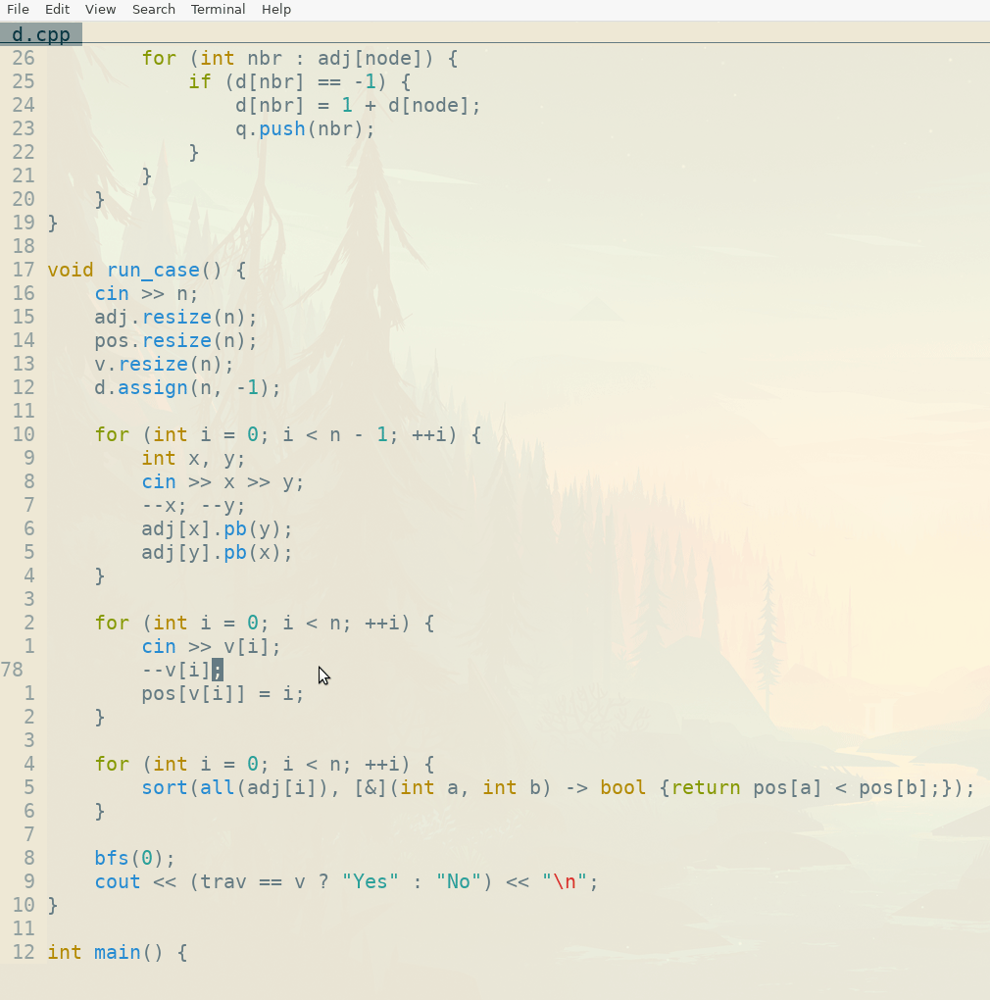

# RunSamples
A program to automatically run competitive programming test cases stored as text files against a C++ program. It is built to work with Linux-style paths and has only been tested on Ubuntu, but it can easily be modified to work on Windows. The script will look for files named `inX.txt` and `ansX.txt`, where `X` is an integer, and it will use them as input and expected output, respectively. In addition, it will look for a json file with the same name as the source code file but with the suffix `:tests`, so that it can be combined with the very useful extension [Competitive Companion](https://codeforces.com/blog/entry/60073). For example, if the .cpp file is `a.cpp`, the json file should be `a.cpp:tests`

## Demo - Integration with Vim



## Requirements

* Python 3 (Only tested on Python 3.8.10).

## Instalation

* Download the python script `eval_samples.py`.

## Usage

```bash
python3 ./eval_samples.py {ABSOLUTE_PATH_OF_EXECUTABLE} {PARENT_DIRECTORY_OF_THE_EXECUTABLE}
```

## Json File Expected Format

```
[
    {
        "test": "4\n1 2\n1 3\n2 4\n1 2 3 4\n",
        "correct_answers": ["Yes\n"]
    },

    {
        "test": "4\n1 2\n1 3\n2 4\n1 2 4 3\n",
        "correct_answers": ["No\n"]
    }
]
```

You can use the Python script `makesamples.py` to save the json file with the expected format. Note that to use this script you will need some additional requirements. This script will take as an argument the name (without extension) of the .cpp file that you want to download test cases for.

## Integration with Vim

The program can be integrated to work very nicely with the Vim text editor. I have included a bash file with the compilation flags I use so that I can compile the program easily and run it imediatly after. You can download the bash file `build.sh` to use it (you can also add it to $PATH so that you don't have to type its absolute path). The way I have set it up is with the following line of code in my .vimrc. You can map it to any keybind of your preference.

```bash
!build.sh %:p:h/%:r && python3 "{PATH_TO_PYTHON_SCRIPT}" %:p:h/%:r %:r
```

This will compile the current file in vim and then run it against the sample test cases in the current directory using the Python script.

