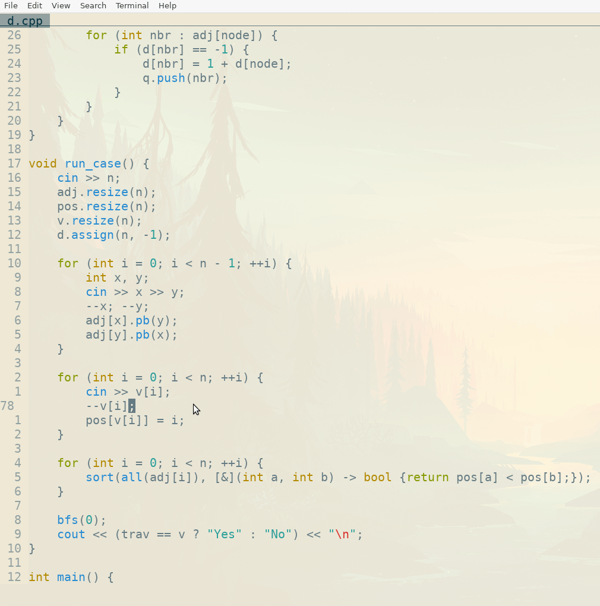

# RunSamples

Run a competitive programming solution against its sample tests, from the editor,
with real verdicts: **AC / WA / RE / TLE**.

Tests are read from two places, and both can be used at once:

* a [Competitive Companion](https://codeforces.com/blog/entry/60073) json file
  next to the source, named `<source>:tests` — so `a.cpp` pairs with `a.cpp:tests`
* loose `inN.txt` / `ansN.txt` pairs in the working directory

Everything is standard library only — there is nothing to `pip install`.

## Demo - Integration with Vim



## Requirements

* Python 3.8+
* `g++` if you use `build.sh`

## Installation

Put the scripts somewhere on your `PATH`:

```bash
git clone https://github.com/LuisSalvadorHeysen/RunSamples
cd RunSamples
chmod +x scripts/*
ln -s "$PWD"/scripts/* ~/bin/     # or wherever your PATH points
```

Symlinking rather than copying matters: if you keep a second copy in `~/bin`,
whichever directory comes first in `PATH` wins and edits to the other one
silently do nothing.

## Usage

```bash
eval_samples.py <executable>
```

The name may be given with or without a source extension (`a` and `a.cpp` both
work). Every test runs, then an interactive console opens.

```
  -t, --timeout N   per-test time limit in seconds (default 10, or $EVAL_TIMEOUT)
  -e, --exact       require an exact match instead of comparing tokens
  -n, --no-repl     run the tests and exit, skipping the console
```

Output is compared token by token, so trailing spaces and a missing final
newline do not cause a spurious WA. Use `--exact` when whitespace is significant.

The exit status is 0 only if every test passed, so it chains cleanly:

```bash
build.sh a && eval_samples.py a
```

A test that exits non-zero or dies on a signal is reported as **RE** with the
signal name — a segfault or a failed `assert` is never silently reported as WA.
A test that runs past the time limit is killed and reported as **TLE**.
Anything the program writes to stderr is shown separately and never judged, so
debug macros that print to `cerr` are safe to leave in.

### Console commands

```
run [n]     Run every test, or just json test n.
runf n      Run the test loaded from in<n>.txt.
ac n        Accept the last output of json test n as correct (n=-1: all).
wa n        Un-accept the last output of json test n.
new         Read a test from stdin (Ctrl-D to finish) and save it.
del n       Delete json test n.
dpans n     Show the saved correct answers for json test n.
list        List all tests with their latest verdict.
numtests    Print the number of tests.
help        Show this list.
quit / q    Exit. Ctrl-D also works.
```

## Fetching tests

`makesamples.py` listens for the Competitive Companion browser extension and
writes the json file for you:

```bash
makesamples.py a          # writes a.cpp:tests
makesamples.py            # names files a, b, c, ... — use with "parse all"
makesamples.py --ext py   # writes a.py:tests instead
```

It handles a whole contest batch in one go and exits when the last problem
arrives, or after `--timeout` seconds (default 120).

## Json file format

```json
[
  {
    "test": "4\n1 2\n1 3\n2 4\n1 2 3 4\n",
    "correct_answers": ["Yes\n"]
  },
  {
    "test": "4\n1 2\n1 3\n2 4\n1 2 4 3\n",
    "correct_answers": ["No\n"]
  }
]
```

`correct_answers` is a list because some problems accept several outputs; use
the `ac` console command to add the current output to it. Raw Competitive
Companion files using `input` / `output` keys are also accepted on read.

## Integration with Vim

`build.sh` compiles with debug and sanitizer flags turned on. Map it to a key:

```vim
nnoremap <C-b> :w<CR>:!build.sh %:r && eval_samples.py %:r<CR>
```

`build.sh` respects `CXX`, `CXX_STD`, and `SANITIZE=0` (to turn off the
sanitizers when you want a timing run).

## License

MIT
